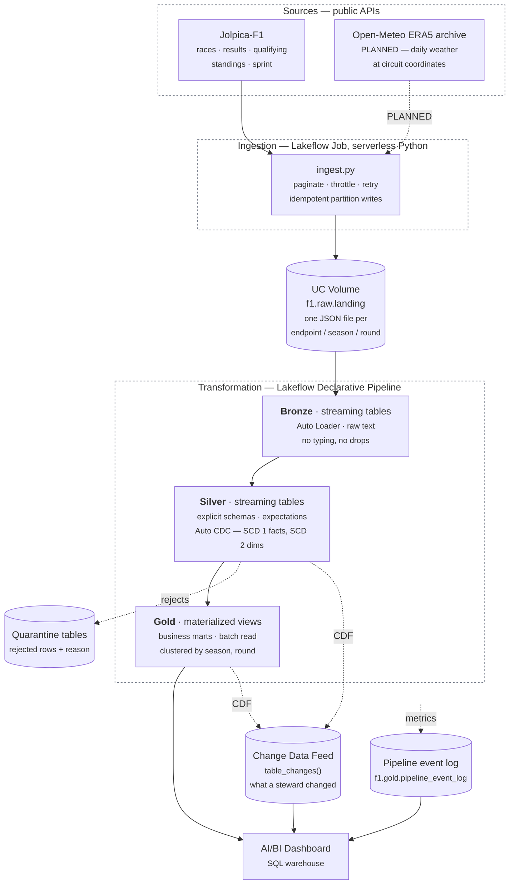

# Architecture

F1 Race Intelligence — a batch lakehouse that turns three public APIs into a
dashboard an F1 reporter or fan can answer questions from.

**Status legend.** Everything below is **built** unless marked **PLANNED**.
The weather source and the `race_conditions` mart are designed but not yet
implemented; they are documented here because they change the shape of the
serving layer and the decision record should predate the code.

---

## 1. What this is for

The audience is people who follow Formula 1 and want to interrogate a season
rather than read a summary of it: reporters checking a claim before publishing,
and fans arguing about whether a result was earned or inherited.

That audience determines the architecture more than the data volume does. The
data is small — three seasons, roughly 1,200 race results — so nothing here is
sized for scale. It is sized for **trust**: every number on the dashboard has to
be traceable to a raw API payload, and a wrong number has to be findable rather
than merely absent.

## 2. Overview



Nothing leaves Databricks. The dashboard reads Gold through a SQL warehouse;
there is no application server, no cache, and no second copy of the data.

### 2.1 Data flow

```
Jolpica-F1 REST API          Open-Meteo ERA5 archive
   results · qualifying         daily observations at
   standings · sprint           circuit coordinates
   laps · pitstops · circuits            │
            │                            │
            └──────────────┬─────────────┘
                           ↓  scheduled Job — throttled, retried, idempotent,
                              backfill-capable, closed rounds skipped
UC Volume  f1.raw.landing
   raw JSON, one file per call, partitioned endpoint/season/round,
   wrapped in a provenance envelope (_ingest_ts, _source_url, _endpoint)
                           ↓  Auto Loader · cloudFiles · format=text
Bronze     streaming tables, one per endpoint
   raw capture · nothing typed · nothing dropped · warn-level expectations
                           ↓  explicit schema → temporary view → Auto CDC
Silver     streaming tables
   facts   · Auto CDC SCD Type 1, keyed on natural grain, sequenced by _ingest_ts
   dims    · Auto CDC SCD Type 2 on the attribute that changes (constructor)
   quality · expect_or_drop + a quarantine table recording the rule violated
                           ↓  batch read, dimensions joined as-of race date
Gold       materialized views
   business marts · clustered by (season, round) · metrics defined once
                           ↓
AI/BI Dashboard            +  Change Data Feed on Silver facts and Gold marts
   post-race analysis          → table_changes() answers "what did the
                                  stewards change after publication"
```

**Counts, today and at target:**

| Layer | Today | With weather, laps, pit stops, circuits |
|---|---|---|
| Landing endpoints | 8 | **12** |
| Bronze streaming tables | 8 | **12** |
| Silver facts | 5 | **8** |
| Silver dimensions | 3 *(2 SCD-2)* | **4** *(2 SCD-2)* |
| Silver quarantine | 6 | **9** |
| Gold marts | 2 | **5** |

Each arrow is a boundary something can be checked at: file counts against the
Volume, Bronze row counts against file counts, quarantine counts against
expectations, and the Gold reconciliation query against published standings.

## 3. Pipeline architecture pattern

**Batch, single path.** Not Lambda, not Kappa.

Formula 1 produces data roughly 24 times a year, in bursts, hours after each
race. There is no stream to speak of, and a streaming path maintained alongside
a batch path — the Lambda tax — would double the code that has to agree with
itself in exchange for latency nobody has asked for.

Bronze and Silver use streaming tables — incremental file discovery and
incremental row processing, not a streaming architecture. Auto Loader gives
exactly-once file handling and checkpointing without anyone polling a directory,
and Auto CDC applies each landed payload as an upsert. Gold is materialised
views, which recompute when an upstream row is amended; streaming tables would
not, and amendment is the case that matters here.

**Latency target: hours, not seconds.** A race ends and the dashboard is right
by the next scheduled run.

## 4. Ingestion

`src/ingestion/` — a plain Python module run as a serverless
`spark_python_task`, orchestrated by the `f1_ingest_incremental` job.

- **Two modes.** `--mode backfill` walks every configured season;
  `--mode incremental` re-polls only the live one. Backfill is the
  reprocessing mechanism, not a separate code path.
- **Idempotent partition writes.** `landing_writer.should_write` treats a round
  as *closed* once a later round exists with a non-empty results payload. Closed
  rounds are never re-fetched, so a re-run costs roughly 8 API calls instead of
  260.
- **Provenance envelope.** Every landed file is one single-line JSON object
  wrapping the raw payload with `_ingest_ts`, `_source_url`, `_season`,
  `_round`, `_endpoint`. The API response is preserved byte for byte inside it.
- **Politeness.** 2 requests/second against Jolpica's 4/s burst and 500/hour
  sustained limits, with exponential backoff and `Retry-After` honoured.

### 4.1 Weather — PLANNED

Weather needs `(latitude, longitude, date)` per race. That already exists in the
Jolpica races payload under `Circuit.Location`, and `ingest.py` **already
fetches the race calendar first** to discover which rounds exist.

So weather is not a second pipeline. It is a second endpoint written in the same
pass, from data already in memory:

```
fetch races  ->  parse calendar (round, date, lat, long)
             ->  for each closed round: Open-Meteo archive
             ->  landing/weather/season=X/round=Y/
```

The alternative — reading `f1.silver.dim_race` for coordinates — was rejected
because it inverts the dependency: the pipeline would have to run before
ingestion, which runs before the pipeline.

**ERA5 lags roughly five days.** Recent and future races return no observation.
That must land as *absent*, never as zero: a race with no weather record is not
a dry race, and a dashboard that renders it as 0.0 mm is lying. Silver keeps the
row with nulls and a `weather_available` flag.

## 5. Transformation — Lakeflow Declarative Pipelines

`src/pipeline/`, one LDP pipeline. Everything from the landing Volume onward is
declarative: dataset definitions, not orchestration steps.

### 5.1 Dataset type per layer

The choice of dataset type is the architecture. It is not a style preference —
a streaming table and a materialised view behave differently under change, and
picking the wrong one shows up as stale aggregates or a full recompute nobody
asked for.

| Layer | Dataset type | Why this one |
|---|---|---|
| Bronze | **Streaming table** + Auto Loader | Files arrive incrementally and are never revised in place |
| Silver staging | **Temporary view** | Preprocessing feeding a CDC flow; nothing worth persisting |
| Silver facts | **Streaming table** + Auto CDC, SCD Type 1 | A result can be *amended* — keep the corrected row, not both |
| Silver dimensions | **Streaming table** + Auto CDC, SCD Type 2 | A driver's constructor changes and the history is the point |
| Gold marts | **Materialised view**, batch read | Aggregations and joins over the full set; MVs recompute when sources change, streaming tables would not |

### 5.2 Bronze — capture

One streaming table per endpoint, generated by a factory over an `ENDPOINTS`
list so adding a source is a list entry rather than a new file.

Files are read as **text**, not JSON. The writer lands exactly one single-line
JSON object per file, so `wholeText` yields one row per file with the payload
intact. Reading as JSON would make Auto Loader infer a schema per endpoint, and
optional Ergast fields (`FastestLap`, `Sprint`, `Q3`) appear in only some files
— schema evolution would then fail and retry the pipeline the first time an
unusual file arrived. **Deferring parsing to Silver is the schema-evolution
strategy**, not an omission: a new upstream field lands in Bronze harmlessly and
is picked up when someone adds it to the explicit Silver schema.

Bronze never drops a row and never types a field.

### 5.3 Silver — conform, with Auto CDC

Explicit `StructType` per endpoint in a temporary view, then a CDC flow into a
streaming table.

**Facts use Auto CDC Type 1.** This is the change from a straight
materialised view, and the reason is a property of the sport rather than of the
data platform: **a Formula 1 result is provisional when it is published.**
Stewards apply penalties after the flag — a five-second penalty reorders the
classification, a disqualification removes a car entirely, and Jolpica reissues
the payload. Type 1 keyed on the natural grain means the corrected row replaces
the provisional one:

```
dp.create_auto_cdc_flow(
    target="fact_result",
    source="stg_result",
    keys=["season", "round", "driver_id"],
    sequence_by="_ingest_ts",
    stored_as_scd_type=1,
)
```

`sequence_by="_ingest_ts"` makes late arrival safe: an older file replayed after
a newer one is ignored rather than resurrecting a superseded result. That also
replaces the window-function dedupe — the CDC flow *is* the deduplication.

**Dimensions use Auto CDC Type 2**, tracking the attribute that actually
changes: a driver's constructor. This is what lets Gold answer "who did they
drive for *at that race*" rather than "who do they drive for now". Current rows
are `WHERE __END_AT IS NULL`.

**Expectations and quarantine are unchanged.** Rules are declared once as dicts
and used twice — `@expect_all_or_drop` on the fact, and the inverse on a
`quarantine_*` table that also records which rules a row violated. A rejected
row is visible, not silently gone. `@expect_or_fail` is reserved for conditions
that should stop the pipeline rather than quietly discard data.

### 5.4 Change Data Feed — where it earns its place

**CDF is not needed to make this pipeline incremental.** LDP already does that:
streaming tables process only new data, and materialised views on serverless
refresh incrementally. Enabling CDF for internal plumbing would be cargo cult.

It is enabled for a different reason — **auditing amendments**.

Because results are provisional, the interesting question for a reporter is not
only "what is the classification" but "**did it change, and when**". Auto CDC
Type 1 gives the correct current row and, by design, discards the previous one.
CDF is what preserves the fact that a change happened:

```
table_properties={"delta.enableChangeDataFeed": "true"}
```

on `fact_result` and on the Gold marts. Downstream, `table_changes()` answers:

- *Which classifications were revised after publication, and by how many places?*
- *Which championship positions changed as a result of a stewards' decision
  rather than a race?*
- *What changed on the dashboard since the last pipeline run?*

That is a post-race analysis question this dataset can answer and most cannot,
and it costs one table property.

**The boundary is worth stating plainly:** Auto CDC is how rows get *into* the
tables correctly; CDF is how consumers see what *changed*. They are different
mechanisms and the pipeline uses both for different jobs.

### 5.5 Gold — serve

Business marts as materialised views with batch reads over the Silver streaming
tables, `cluster_by=["season", "round"]`.

Batch read, not streaming: these are aggregations and joins across the full
dataset, and a streaming table would not recompute them when an upstream row is
amended — which, given everything above, is exactly the case that matters.

| Mart | Grain | Answers |
|---|---|---|
| `driver_performance` | driver × race | What happened |
| `championship_progression` | driver × round | What it cost in the title race |
| `race_conditions` **PLANNED** | race | Was it the weather |
| `race_strategy` **PLANNED** | driver × race | Was it the pit wall — stints, stops, undercut |
| `lap_pace` **PLANNED** | driver × race | Who was actually fast — median lap, degradation |

## 6. Serving model

**One big table per question, not a normalised warehouse.**

Silver holds a conformed star — `dim_driver`, `dim_constructor`, `dim_race`
around `fact_result`, `fact_qualifying`, `fact_sprint_result`,
`fact_driver_standing`, `fact_constructor_standing`. That is where the modelling
discipline lives, and where the SCD-2 history is kept.

Gold deliberately denormalises that star into wide marts. The reason is the
access pattern: a dashboard tile asks "points by constructor for season X", and
a BI user filtering a chart should not be paying for a five-way join every time.
`driver_performance` resolves the star once, at build time, including the
as-of-race constructor join that is the expensive part.

Design choices behind that:

- **Clustering on `season, round`** — every query filters or groups by season,
  and most also by round.
- **Materialised, not virtual.** The marts are recomputed per update rather than
  defined as views, so dashboard queries never re-run the join logic.
- **No partitioning.** Three seasons is far too little data for partitions to
  help; clustering alone is the right tool at this size.

### Semantic consistency

Metric definitions live in the mart columns, not in dashboard tiles — `is_win`,
`is_podium`, `is_points_finish`, `dnf_flag` and `positions_gained` are computed
once in Gold. A tile that counts wins and a tile that ranks drivers are counting
the same thing by construction.

**Gap:** there is no separate metric-definition view layer. At this scale the
mart columns are that layer; if the mart set grows, unified metric views over
Gold would be the next step.

## 7. Orchestration

Lakeflow Jobs. `f1_ingest_incremental` runs two tasks in order:

```
ingest  ->  refresh_pipeline (depends_on: ingest)
```

Ingestion and transformation are one scheduled unit, so the pipeline never runs
against a landing zone that is mid-write. Scheduled weekly, and **paused in the
`dev` target** — Databricks Asset Bundles pause every schedule automatically in
development mode, which is what stops a work-in-progress branch from writing to
shared tables.

Deployment is declarative: `databricks.yml` plus `resources/*.yml` define the
job, the pipeline and the dashboard as code, with `dev` and `prod` targets
pointing at different catalogs.

## 8. Error handling and resilience

| Failure | Handling |
|---|---|
| API timeout / 5xx | Exponential backoff, bounded retries, `Retry-After` honoured |
| Rate limiting | 2 req/s throttle, inside Jolpica's published limits |
| Partial ingestion failure | Failures collected per season and reported in the run summary; other seasons still complete |
| Malformed payload | Bronze keeps it as text; Silver's explicit schema yields nulls, which expectations then catch |
| Missing values | Expectation rules per fact; violating rows routed to `quarantine_*` with the reason |
| Duplicate records | Window-function dedupe on business key in every `stg_*` view |
| Schema evolution | Bronze reads text and never infers; new upstream fields are inert until added to a Silver schema |
| Re-running a completed load | `should_write` skips closed rounds; Auto Loader checkpoints skip processed files |
| Backfill | `--mode backfill` reprocesses every season through the same code path |

## 9. Logging and monitoring

- **Ingestion** emits structured `logging` output and a run summary: files
  written, partitions skipped, API requests made, and every failure by name.
- **Pipeline** publishes its event log to `f1.gold.pipeline_event_log`, which
  makes expectation pass/fail counts, row counts and update duration
  *queryable* rather than only visible in the UI.
- **`sql/dq_event_log.sql`** turns that event log into per-dataset expectation
  metrics; **`sql/validation_checks.sql`** holds correctness assertions over the
  marts.
- **Job run history** carries success/failure and duration per task.

**Gap:** no alerting. A failed scheduled run is visible in the run list and in
the event log, but nothing pages anyone.

## 10. Compliance, security and governance

- **Data licence.** Jolpica-F1 is a public, non-commercial Ergast successor;
  Open-Meteo's archive is free for non-commercial use. Both are attributed in
  the README. No scraping, no authentication, no terms circumvented.
- **Secrets.** There are none to leak — both APIs are keyless, and no
  credential appears anywhere in the codebase or configuration. Databricks
  authentication is the CLI's OAuth profile, held outside the repository. Were a
  keyed source added, it would go in a Databricks secret scope referenced by
  name, never a literal.
- **PII.** None. Drivers and constructors are public figures acting in a public
  competition; there are no personal identifiers, contact details or private
  attributes anywhere in the data.
- **Access control.** Unity Catalog governs the three schemas. Raw, Bronze,
  Silver and Gold are separable grants, so a dashboard consumer can be given
  `SELECT` on `f1.gold` without any access to raw payloads.
- **Lineage.** Unity Catalog records table-level lineage automatically from the
  pipeline graph. Row-level provenance is stronger than usual here: every Bronze
  row keeps `_source_url`, `_ingest_ts` and `_file_path`, so any number on the
  dashboard can be traced to the API call that produced it.

## 11. Testing

Data quality is enforced in the pipeline (expectations, quarantine, validation
SQL) and pre-flight (`scripts/check_expectations.py` verifies every column named
in an expectation exists in the staged view, before a cluster starts).

**Gap: there is no unit test suite.** The transformation logic — dedupe window
selection, expectation rule construction, the ingestion's closed-round
predicate — is exercised only by running the pipeline. `should_write` and the
Silver rule dictionaries are pure functions and the obvious first candidates.

## 12. Deliberately out of scope

- **Streaming.** The data arrives 24 times a year.
- **Containerisation.** Execution is serverless Databricks compute with
  declared environment specs; the reproducibility that Docker would provide is
  already provided by the bundle and the environment definition. A container
  would add a build step and an image registry for no gain.
- **Embeddings, vector search, an operational serving database, or an agent.**
  A separate project explores that direction. This one answers questions with
  SQL over a dashboard, and keeping it that way is what makes it maintainable.

## 13. Criteria coverage

Assessed against the technical-execution minimum criteria.

| Criterion | Status | Where |
|---|---|---|
| Data ingestion into raw storage | **Met** | `src/ingestion/`, orchestrated job, UC Volume |
| Transformation in phases | **Met** | Bronze / Silver / Gold, Lakeflow Declarative Pipeline |
| Layered architecture framework | **Met** | Medallion |
| Pipeline architecture pattern | **Met** | Batch, single path — §3 |
| Incremental processing | **Met** | Streaming tables + Auto Loader; Auto CDC upserts — §5.1, §5.3 |
| Change data capture | **Met** | Auto CDC: SCD 1 facts, SCD 2 dimensions — §5.3 |
| Change tracking for consumers | **Met** | Change Data Feed on Silver facts and Gold marts — §5.4 |
| Serving model paradigm | **Met** | Silver star schema, Gold OBT marts |
| Semantic model consistency | **Partial** | Metrics defined once in Gold columns; no separate metric-view layer |
| Access-pattern-aware design | **Met** | Clustering, materialisation, denormalisation — §6 |
| Orchestration | **Met** | Lakeflow Jobs, task dependency, schedule |
| Containerisation | **N/A** | Serverless with declared environments — §12 |
| Data quality checks | **Met** | Expectations, quarantine tables, validation SQL |
| Unit test for transformation logic | **NOT MET** | §11 |
| Serving layer accessible downstream | **Met** | Gold via SQL warehouse, AI/BI dashboard |
| Ingestion/processing failure handling | **Met** | §8 |
| Malformed files, missing values | **Met** | §8 |
| Duplicate records | **Met** | Dedupe in every `stg_*` |
| Schema evolution | **Met** | Text Bronze, explicit Silver — §5.2 |
| Backfilling mechanism | **Met** | `--mode backfill` |
| Structured logs, status, duration | **Met** | §9 |
| Monitoring | **Partial** | Event log and run history queryable; no alerting |
| Public / licensed data | **Met** | §10 |
| Secure credential handling | **Met (vacuous)** | No credentials exist — §10 |
| Least-privilege access | **Met** | Unity Catalog schema grants |
| PII handling | **N/A** | No PII in the data |
| Lineage and documentation | **Met** | UC lineage, row-level provenance, this document |

### Gaps to close

1. **Unit tests.** The one hard miss. Start with `landing_writer.should_write`
   and the Silver rule dictionaries — pure functions, no Spark session needed.
2. **Metric views.** A semantic layer over Gold if the mart set grows.
3. **Alerting.** A Databricks alert on failed runs or on a quarantine row count
   crossing zero.
