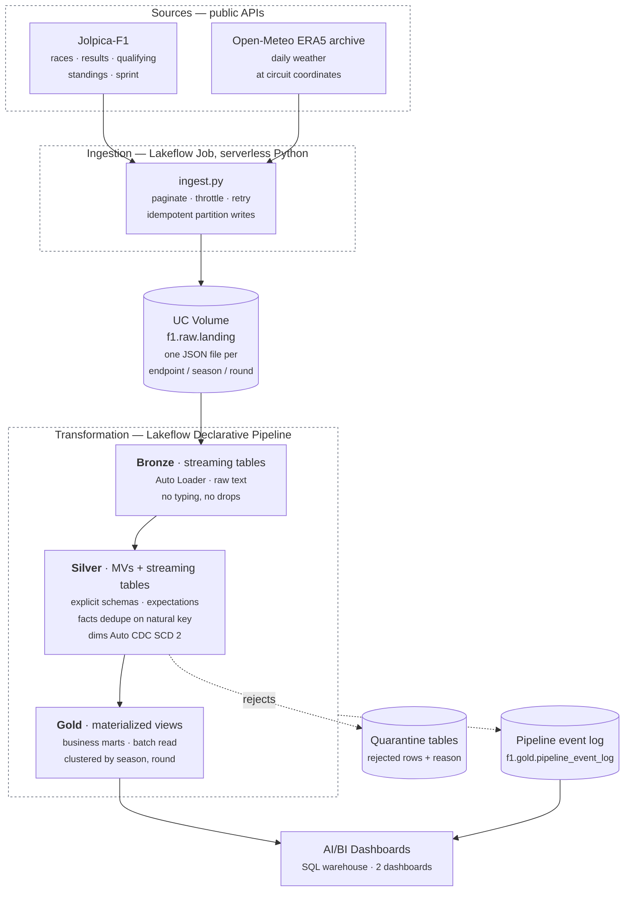

# Architecture

F1 Race Intelligence — a batch lakehouse that turns three public APIs into a
dashboard an F1 reporter or fan can answer questions from.

**Everything described here is built and running.** Where something was
considered and deliberately not done, it says so — §5.4 on Change Data Feed is
the one that matters, because an earlier draft of this document described it as
enabled when it never was.

---

## 1. What this is for

The audience is people who follow Formula 1 and want to interrogate a season
rather than read a summary of it: reporters checking a claim before publishing,
and fans arguing about whether a result was earned or inherited.

That audience determines the architecture more than the data volume does. The
data is small — three seasons so far, roughly 1,200 race results — so nothing here is
sized for scale. It is sized for **trust**: every number on the dashboard has to
be traceable to a raw API payload, and a wrong number has to be findable rather
than merely absent.

## 2. Overview



Nothing leaves Databricks. The dashboard reads Gold through a SQL warehouse;
there is no application server, no cache, and no second copy of the data.

### 2.1 Data flow

```
Jolpica-F1 REST API          Open-Meteo ERA5 archive
   results · qualifying         daily observations at
   standings · sprint           circuit coordinates
   laps · pitstops · circuits            │
            │                            │
            └──────────────┬─────────────┘
                           ↓  scheduled Job — throttled, retried, idempotent,
                              backfill-capable, closed rounds skipped
UC Volume  f1.raw.landing
   raw JSON, one file per call, partitioned endpoint/season/round,
   wrapped in a provenance envelope (_ingest_ts, _source_url, _endpoint)
                           ↓  Auto Loader · cloudFiles · format=text
Bronze     streaming tables, one per endpoint
   raw capture · nothing typed · nothing dropped · warn-level expectations
                           ↓  explicit schema → temporary view → dedupe / CDC
Silver     facts   · materialized views, deduplicated on natural key by
                     greatest _ingest_ts (a full-partition window function)
           dims    · streaming tables, Auto CDC SCD Type 2 on the attribute
                     that changes (constructor), read from Bronze directly
           quality · expect_or_drop + a quarantine table recording the rule
                     violated
                           ↓  batch read, dimensions joined as-of race date
Gold       materialized views
   business marts · clustered by (season, round) · metrics defined once
                           ↓
2 AI/BI Dashboards
   championship & performance  |  pace & reliability
```

**Counts, as built:**

| Layer | Count | |
|---|---|---|
| Landing endpoints | 11 | 10 Jolpica + Open-Meteo weather |
| Bronze streaming tables | 11 | one per endpoint |
| Silver facts | 8 | result, sprint, qualifying, 2 × standings, weather, pit stop, lap |
| Silver dimensions | 3 | `dim_driver` and `dim_constructor` SCD-2; `dim_race` an MV |
| Silver quarantine | 9 | one per fact |
| Gold marts | 5 | + the pipeline event log |

There is no `dim_circuit` and no separate `circuits` endpoint: circuit identity
and coordinates arrive inside the races payload, so a fourth dimension would
have restated data `dim_race` already carries.

Each arrow is a boundary something can be checked at: file counts against the
Volume, Bronze row counts against file counts, quarantine counts against
expectations, and the Gold reconciliation query against published standings.

## 3. Pipeline architecture pattern

**Batch, single path.** Not Lambda, not Kappa.

Formula 1 produces data roughly 24 times a year, in bursts, hours after each
race. There is no stream to speak of, and a streaming path maintained alongside
a batch path — the Lambda tax — would double the code that has to agree with
itself in exchange for latency nobody has asked for.

Bronze uses streaming tables — incremental file discovery, not a streaming
architecture. Auto Loader gives exactly-once file handling and checkpointing
without anyone polling a directory.

Silver splits by need. Facts are materialised views, because deduplication here
is a full-partition window function and streaming append mode cannot express
one. Dimensions are streaming tables fed by Auto CDC, because SCD Type 2
requires a streaming source — which is also why those flows read Bronze
directly rather than the fact MVs: a materialised view cannot be streamed from.

Gold is materialised views, which recompute when an upstream row is amended;
streaming tables would not, and amendment is the case that matters here.

**Latency target: hours, not seconds.** A race ends and the dashboard is right
by the next scheduled run.

## 4. Ingestion

`src/ingestion/` — a plain Python module run as a serverless
`spark_python_task`, orchestrated by the `f1_ingest_incremental` job.

- **Two modes.** `--mode backfill` walks every configured season;
  `--mode incremental` re-polls only the live one. Backfill is the
  reprocessing mechanism, not a separate code path.
- **Idempotent partition writes.** `landing_writer.should_write` treats a round
  as *closed* once a later round exists with a non-empty results payload. Closed
  rounds are never re-fetched, so a re-run costs roughly 8 API calls instead of
  260.
- **Provenance envelope.** Every landed file is one single-line JSON object
  wrapping the raw payload with `_ingest_ts`, `_source_url`, `_season`,
  `_round`, `_endpoint`. The API response is preserved byte for byte inside it.
- **Politeness.** 0.5 requests/second and a 450/hour budget, against Jolpica's
  published 4/s burst and 500/hour sustained limits, with exponential backoff
  and `Retry-After` honoured. The published burst rate is not the enforced one:
  2 req/s produced a 429 on roughly 37% of requests during a laps backfill, and
  every retry spends the hourly allowance twice — once on the rejection and
  again on the retry. Slower per request, faster overall.
- **Seasons are derived, never hardcoded.** `config.live_season()` is the
  calendar year and a routine run also revisits the previous season, because a
  December race stays open into January while results are still being
  corrected. A hardcoded live season is a job that keeps succeeding and
  ingesting nothing from 1 January onward.

### 4.1 Weather

Weather needs `(latitude, longitude, date)` per race. That already exists in the
Jolpica races payload under `Circuit.Location`, and `ingest.py` **already
fetches the race calendar first** to discover which rounds exist.

So weather is not a second pipeline. It is a second endpoint written in the same
pass, from data already in memory:

```
fetch races  ->  parse calendar (round, date, lat, long)
             ->  for each closed round: Open-Meteo archive
             ->  landing/weather/season=X/round=Y/
```

The alternative — reading `f1.silver.dim_race` for coordinates — was rejected
because it inverts the dependency: the pipeline would have to run before
ingestion, which runs before the pipeline.

**ERA5 lags roughly five days.** Recent and future races return no observation.
That must land as *absent*, never as zero: a race with no weather record is not
a dry race, and a dashboard that renders it as 0.0 mm is lying. Silver keeps the
row with nulls and a `weather_available` flag.

## 5. Transformation — Lakeflow Declarative Pipelines

`src/pipeline/`, one LDP pipeline. Everything from the landing Volume onward is
declarative: dataset definitions, not orchestration steps.

### 5.1 Dataset type per layer

The choice of dataset type is the architecture. It is not a style preference —
a streaming table and a materialised view behave differently under change, and
picking the wrong one shows up as stale aggregates or a full recompute nobody
asked for.

| Layer | Dataset type | Why this one |
|---|---|---|
| Bronze | **Streaming table** + Auto Loader | Files arrive incrementally and are never revised in place |
| Silver staging | **Temporary view** | Preprocessing feeding a CDC flow; nothing worth persisting |
| Silver facts | **Materialised view** + window dedupe | A result can be *amended* — keep the newest row, not both. Deduplication is a full-partition window function, which streaming append mode cannot express |
| Silver dimensions | **Streaming table** + Auto CDC, SCD Type 2 | A driver's constructor changes and the history is the point. Auto CDC needs a streaming source, so these read Bronze directly |
| Gold marts | **Materialised view**, batch read | Aggregations and joins over the full set; MVs recompute when sources change, streaming tables would not |

### 5.2 Bronze — capture

One streaming table per endpoint, generated by a factory over an `ENDPOINTS`
list so adding a source is a list entry rather than a new file.

Files are read as **text**, not JSON. The writer lands exactly one single-line
JSON object per file, so `wholeText` yields one row per file with the payload
intact. Reading as JSON would make Auto Loader infer a schema per endpoint, and
optional Ergast fields (`FastestLap`, `Sprint`, `Q3`) appear in only some files
— schema evolution would then fail and retry the pipeline the first time an
unusual file arrived. **Deferring parsing to Silver is the schema-evolution
strategy**, not an omission: a new upstream field lands in Bronze harmlessly and
is picked up when someone adds it to the explicit Silver schema.

Bronze never drops a row and never types a field.

### 5.3 Silver — conform

Explicit `StructType` per endpoint in a temporary view, then either a
deduplicating materialised view (facts) or a CDC flow into a streaming table
(dimensions).

**Facts deduplicate on the natural key.** The reason is a property of the sport
rather than of the platform: **a Formula 1 result is provisional when it is
published.** Stewards apply penalties after the flag — a five-second penalty
reorders the classification, a disqualification removes a car entirely — and
Jolpica reissues the payload. Ingestion also re-pulls the open round on every
run by design. Both produce several landed files for the same round, and the
newest one wins:

```python
window = Window.partitionBy("season", "round", "driver_id").orderBy(
    F.col("_ingest_ts").desc(), F.col("_file_path").desc()
)
df.withColumn("_rn", F.row_number().over(window)).filter(F.col("_rn") == 1)
```

That is a full-partition window function, which a streaming table in append
mode cannot express — hence a materialised view. It also makes late arrival
safe: an older file replayed after a newer one loses the ordering and is
dropped rather than resurrecting a superseded result.

The idempotency contract has two halves and **both are required**: ingestion
skips closed rounds and re-pulls the open one, and Silver deduplicates by
natural key. Remove either and the live round double-counts.

**Dimensions use Auto CDC Type 2**, tracking the attribute that actually
changes: a driver's constructor. This is what lets Gold answer "who did they
drive for *at that race*" rather than "who do they drive for now". Current rows
are `WHERE __END_AT IS NULL`.

```python
dp.create_auto_cdc_flow(
    target="dim_driver",
    source="stg_driver_version",
    keys=["driver_id"],
    sequence_by="race_date",
    stored_as_scd_type=2,
)
```

`dim_driver` is built from the **results** endpoint, not `/drivers`. Every
field `/drivers` returns is static, so Auto CDC over it yields a dimension with
no history at all — the pattern implemented but never exercised. The attribute
that changes is the constructor, and it only appears in results. This produces
42 versions across 28 drivers, 14 of them historical.

**Expectations and quarantine.** Rules are declared once as dicts and used
twice — `@expect_all_or_drop` on the fact, and the inverse on a `quarantine_*`
table that also records which rules a row violated. A rejected row is visible,
not silently gone. `@expect_or_fail` is reserved for conditions that should stop
the pipeline rather than quietly discard data.

The census is not expected to be empty, and that is the point: 69 lap rows fail
`plausible_lap_time` (red-flag and safety-car laps outside 40–300 s), 8
standings rows arrive with no championship position, and 2 pit stops are
published with an empty duration. Zero everywhere would mean the expectations
had stopped being evaluated.

### 5.4 Change Data Feed — considered, not enabled

**An earlier draft of this document described CDF as enabled on `fact_result`
and the Gold marts. It never was** — `delta.enableChangeDataFeed` appears
nowhere in `src/`. The section is kept, corrected, because the reasoning is
still the right reasoning and the gap is worth stating rather than quietly
deleting.

CDF is not needed to make this pipeline incremental. LDP already does that:
streaming tables process only new data, and materialised views on serverless
refresh incrementally. Enabling CDF for internal plumbing would be cargo cult.

The case for it is different — **auditing amendments**. Because results are
provisional, the interesting question is not only "what is the classification"
but "*did it change, and when*". The Silver dedupe keeps the newest row and, by
design, discards the one it replaced; CDF is what would preserve the fact that a
change happened, and let `table_changes()` answer:

- Which classifications were revised after publication, and by how many places?
- Which championship positions changed by a stewards' decision rather than a race?

Turning it on is one table property on the Silver facts and the Gold marts. It
is not done, so **`table_changes()` returns nothing today** and any claim that
this platform tracks amendments for consumers is unsupported.

The boundary is still worth stating: the dedupe is how rows get *into* the
tables correctly; CDF is how consumers would see what *changed*. Different
mechanisms, different jobs.

### 5.5 Gold — serve

Business marts as materialised views with batch reads over the Silver streaming
tables, `cluster_by=["season", "round"]`.

Batch read, not streaming: these are aggregations and joins across the full
dataset, and a streaming table would not recompute them when an upstream row is
amended — which, given everything above, is exactly the case that matters.

| Mart | Grain | Answers |
|---|---|---|
| `driver_performance` | driver × race | What happened |
| `championship_progression` | driver × round | What it cost in the title race |
| `race_conditions` | race | Was it the weather — measured rainfall against retirements |
| `race_strategy` | driver × race | Was it the pit wall — stops, derived stints, strategy vs the field |
| `lap_pace` | driver × race | Who was actually fast — clean-lap median, consistency, laps led |

## 6. Serving model

**One big table per question, not a normalised warehouse.**

Silver holds a conformed star — `dim_driver`, `dim_constructor`, `dim_race`
around `fact_result`, `fact_qualifying`, `fact_sprint_result`,
`fact_driver_standing`, `fact_constructor_standing`. That is where the modelling
discipline lives, and where the SCD-2 history is kept.

Gold deliberately denormalises that star into wide marts. The reason is the
access pattern: a dashboard tile asks "points by constructor for season X", and
a BI user filtering a chart should not be paying for a five-way join every time.
`driver_performance` resolves the star once, at build time, including the
as-of-race constructor join that is the expensive part.

Design choices behind that:

- **Clustering on `season, round`** — every query filters or groups by season,
  and most also by round.
- **Materialised, not virtual.** The marts are recomputed per update rather than
  defined as views, so dashboard queries never re-run the join logic.
- **No partitioning.** Three seasons is far too little data for partitions to
  help; clustering alone is the right tool at this size.

### Semantic consistency

Metric definitions live in the mart columns, not in dashboard tiles — `is_win`,
`is_podium`, `is_points_finish`, `dnf_flag` and `positions_gained` are computed
once in Gold. A tile that counts wins and a tile that ranks drivers are counting
the same thing by construction.

**Gap:** there is no separate metric-definition view layer. At this scale the
mart columns are that layer; if the mart set grows, unified metric views over
Gold would be the next step.

## 7. Orchestration

Lakeflow Jobs, two of them, differing only in what brackets the work.

```
f1_ingest_incremental   weekly, Tue 06:00 UTC, paused in dev
    ingest  ->  refresh_pipeline  ->  validate

f1_end_to_end           on demand
    unit_tests  ->  ingest  ->  refresh_pipeline  ->  validate
```

Ingestion and transformation are one unit, so the pipeline never runs against a
landing zone that is mid-write. **Validation is on the scheduled path**, not
only the manual one: correctness checked when a human remembers is a habit, not
a guarantee, and the weekly job is the run that happens 51 weeks out of 52. It
costs a handful of queries on compute the pipeline task has already started.

`unit_tests` runs first in the manual job so a typo costs seconds rather than a
cluster start. It is absent from the weekly job because pipeline code cannot
change between scheduled runs.

Both jobs declare a one-hour timeout and email on failure. On Free Edition
compute is a daily allowance rather than a bill, so a hung task spends
tomorrow's run as well as today's — and an unwatched failure is
indistinguishable from a quiet week with no new races. Only `ingest` retries:
the landing writer is idempotent, so a retried transport failure is safe, while
a failing assertion fails identically the second time.

Schedules are paused in the `dev` target automatically by Databricks Asset
Bundles, which is what stops a work-in-progress branch from writing to shared
tables.

Deployment is declarative: `databricks.yml` plus `resources/*.yml` define both
jobs, the pipeline and both dashboards as code, with `dev` and `prod` targets
pointing at different catalogs. Neither target pins a workspace host or a CLI
profile — both come from the profile passed on the command line, so a fork
deploys to its own workspace with no edit to the file.

## 8. Error handling and resilience

| Failure | Handling |
|---|---|
| API timeout / 5xx | Exponential backoff, bounded retries, `Retry-After` honoured |
| Rate limiting | 0.5 req/s and a 450/hour budget, below Jolpica's *enforced* rate rather than its published one |
| Partial ingestion failure | Failures collected per season and reported in the run summary; other seasons still complete |
| Malformed payload | Bronze keeps it as text; Silver's explicit schema yields nulls, which expectations then catch |
| Missing values | Expectation rules per fact; violating rows routed to `quarantine_*` with the reason |
| Duplicate records | Window-function dedupe on the natural key in every `stg_*` view, keeping the greatest `_ingest_ts` |
| Schema evolution | Bronze reads text and never infers; new upstream fields are inert until added to a Silver schema |
| Re-running a completed load | `should_write` skips closed rounds; Auto Loader checkpoints skip processed files |
| Backfill | `--mode backfill` reprocesses every season through the same code path |
| A task that hangs | One-hour job timeout; without it a hung run spends the next day's compute allowance too |
| A run that fails unattended | `email_notifications.on_failure` on both jobs |
| Marts that build but do not reconcile | `validate_marts.py` as the final task; a green update is not the bar |

## 9. Logging and monitoring

- **Ingestion** emits structured `logging` output and a run summary: files
  written, partitions skipped, API requests made, and every failure by name.
- **Pipeline** publishes its event log to `f1.gold.pipeline_event_log`, which
  makes expectation pass/fail counts, row counts and update duration
  *queryable* rather than only visible in the UI.
- **`sql/dq_event_log.sql`** turns that event log into per-dataset expectation
  metrics; **`sql/validation_checks.sql`** is the narrative version of the
  correctness assertions and **`scripts/validate_marts.py`** is the same checks
  with an exit code, running as the last task of both jobs.
- **Alerting** is `email_notifications.on_failure` on both jobs. It covers a
  failed run, which is the failure that matters most here.
- **Job run history** carries success/failure and duration per task.

**Gap:** nothing alerts on a *successful* run whose numbers moved — a quarantine
count that jumps, or a reconciliation that starts failing while the job still
reports green, would be caught by `validate_marts.py` failing the task, but a
slow drift below that threshold is invisible.

## 10. Compliance, security and governance

- **Data licence.** Jolpica-F1 is a public, non-commercial Ergast successor;
  Open-Meteo's archive is free for non-commercial use. Both are attributed in
  the README. No scraping, no authentication, no terms circumvented.
- **Secrets.** There are none to leak — both APIs are keyless, and no
  credential appears anywhere in the codebase or configuration. Databricks
  authentication is the CLI's OAuth profile, held outside the repository. Were a
  keyed source added, it would go in a Databricks secret scope referenced by
  name, never a literal.
- **PII.** None. Drivers and constructors are public figures acting in a public
  competition; there are no personal identifiers, contact details or private
  attributes anywhere in the data.
- **Access control.** Applied, not merely available — `scripts/apply_grants.py`
  holds the model and is idempotent:

  | Principal | Catalog | Gold | Silver / Bronze | Landing Volume |
  |---|---|---|---|---|
  | `account users` | `USE_CATALOG` | `SELECT` | — | — |
  | `--engineers <group>` | `USE_CATALOG` | `SELECT` | `SELECT` | `READ_VOLUME` |
  | owner | everything by ownership | | | |

  Read access narrows as the data gets rawer, which is the argument for a
  medallion layout in the first place: a consumer can query
  `f1.gold.driver_performance` and cannot read the Bronze payload behind it.

  Two constraints. Unity Catalog resolves **account-level** groups and user
  emails only — this workspace's `admins` and `users` are workspace-local and UC
  rejects both — so the engineer tier is a parameter rather than a hardcoded
  group. And nobody is granted `WRITE_VOLUME`: the landing zone has exactly one
  writer, the ingestion job, because a second breaks the idempotency contract
  Silver's deduplication depends on.

  **The limit of the demonstration:** on a single-user workspace the owner's
  ownership outranks every grant, so the layering is real in configuration but
  cannot be experienced. Proving it needs a second identity that owns nothing.
- **Lineage.** Unity Catalog records table-level lineage automatically from the
  pipeline graph. Row-level provenance is stronger than usual here: every Bronze
  row keeps `_source_url`, `_ingest_ts` and `_file_path`, so any number on the
  dashboard can be traced to the API call that produced it.

## 11. Testing

Three layers, each catching what the others cannot.

**Local, no Spark, under a second** — `pytest`, 129 tests:

- Ingestion logic: pagination against a `total` that counts inner records,
  the rate budget, the race-calendar parse, `should_write`'s closed-round
  predicate, and season derivation.
- Repository contracts: no legacy `dlt` API, SCD-2 columns double-underscored,
  dashboard widget versions correct, no field named `constructor`, no catalog
  fallback in a pipeline file, no pinned profile in `databricks.yml`, every job
  bounded and alerting, every scheduled job validating.
- Bundle structure: every resource path exists, every `${var.*}` is declared and
  used, every `${resources.*}` reference resolves.
- The access model: the consumer tier reaches Gold and nothing below it, and
  nothing is granted `WRITE_VOLUME`.

**Pre-flight, static** — `scripts/check_expectations.py` walks all five Silver
files and verifies every column named in an expectation exists in the staged
view. This class of bug is otherwise found only by pipeline graph analysis,
which costs a cluster start and quota to learn about a typo.

**On Databricks, with Spark** — `tests/spark/test_pipeline_transforms.py`, run
as the first task of `f1_end_to_end`: the lap-time and pit-duration parsers, the
three-level laps schema, and whether Silver's wet threshold still agrees with
the ingestion config. It executes the real pipeline files with a stubbed `dp`,
so no transformation logic is duplicated into the test — a test that restates
the expression it is testing passes forever, including after the expression
becomes wrong.

PySpark needs a JVM, so these run where Spark already exists rather than
demanding every contributor install Java to run `pytest`.

**CI** runs the credential-free half on every push and pull request. `bundle
validate` is not offline — in `mode: development` it resolves `root_path` from
the current user over SCIM — so it runs only when workspace secrets are present
and skips honestly when they are not.

Every contract assertion corresponds to a mistake that was actually made here
and cost either a failed pipeline update or a dashboard tile that rendered
nothing.

### 6.1 Natural-language access

A Genie agent (`genie/f1_gold_space.json`) sits over the five Gold marts and
nothing else. The scope is the design decision: the marts resolve the
as-of-race-date constructor join and pre-compute `total_points`, so an agent
reading Silver would produce answers that are plausible, well-formatted and
attributed to the wrong team.

It reuses the grant model rather than bypassing it — queries run as the asker,
so a consumer reaching the agent still cannot read Bronze.

Five certified SQL examples teach the query patterns, and a single instruction
block carries the domain rules that change answers. Both are asserted by
`tests/test_genie_space.py`, which also enforces the API's own constraints
(32-hex ids unique across three lists, array-valued text fields, at most one
instruction entry, sorted lists) so a malformed definition fails locally rather
than on a create call.

## 12. Deliberately out of scope

- **Streaming.** The data arrives 24 times a year.
- **Containerisation.** Execution is serverless Databricks compute with
  declared environment specs; the reproducibility that Docker would provide is
  already provided by the bundle and the environment definition. A container
  would add a build step and an image registry for no gain.
- **Embeddings, vector search, an operational serving database, or an agent.**
  A separate project explores that direction. This one answers questions with
  SQL over a dashboard, and keeping it that way is what makes it maintainable.

  That separate project left two tables behind in this catalog:
  `f1.gold.agent_activity_analytics` and `f1.gold.agent_tool_calls`. They are
  **not part of this platform** — no pipeline here writes them, no dashboard
  reads them, and `validate_marts.py` ignores them. They are kept because that
  work resumes later. Browsing `f1.gold` therefore shows eight objects where
  this document describes five marts and an event log; those two are the
  difference.

  One consequence to carry forward: `SELECT` is granted on the `f1.gold`
  *schema*, and Unity Catalog has no `DENY`, so any principal that can read the
  marts can read those two tables as well. On a single-user workspace that is
  nothing. Before a second person is added, move them to their own schema
  first — the grant cannot be narrowed table by table.

## 13. Operational constraints

The environment shapes the design as much as the data does. These are the
constraints that have actually bitten, kept from the build plan because they
outlive it.

| Constraint | What triggers it | How it is handled |
|---|---|---|
| Free Edition daily compute quota | Repeated full refreshes while iterating on Silver | Selective refresh on single tables; never full-refresh to test one expectation. Validation runs on the pipeline's own compute rather than starting a warehouse |
| Catalogs cannot be created over the API | Free Edition refuses the CLI, the storage-root override, and SQL alike | Created once in the UI with Default Storage; `create_catalog.sh` tries all three paths and then says so. Schemas and Volumes are fine over the CLI |
| `laps` dominates the rate limit | Backfilling three seasons in one pass — ~11 pages per round, ~780 requests | Its own endpoint entry, closed-round skip honoured, 0.5 req/s and a 450/hour budget |
| Weather rendering as 0.0 mm | Treating a missing ERA5 observation as dry | `weather_available` flag; ERA5 lags ~5 days and the mart must say "no observation", never "no rain" |
| Changing a dataset type in place | A Silver fact moving between materialised view and streaming table | **Cannot be done in place, and a full refresh does not help.** Drop the table manually or rename the dataset |
| A serverless `spark_python_task` is not a normal Python process | Writing a new job task | `__file__` is undefined, custom `spark.conf` keys raise `CONFIG_NOT_AVAILABLE`, and any `SystemExit` fails the task — including `SystemExit(0)`. All three report as "Workload failed, see run output for details", which names none of them |

## 14. Criteria coverage

Assessed against the technical-execution minimum criteria.

| Criterion | Status | Where |
|---|---|---|
| Data ingestion into raw storage | **Met** | `src/ingestion/`, orchestrated job, UC Volume |
| Transformation in phases | **Met** | Bronze / Silver / Gold, Lakeflow Declarative Pipeline |
| Layered architecture framework | **Met** | Medallion |
| Pipeline architecture pattern | **Met** | Batch, single path — §3 |
| Incremental processing | **Met** | Streaming tables + Auto Loader; incremental MV refresh — §5.1 |
| Change data capture | **Met** | Auto CDC SCD Type 2 on both dimensions; natural-key dedupe on facts — §5.3 |
| Change tracking for consumers | **NOT MET** | Change Data Feed is not enabled; `table_changes()` returns nothing — §5.4 |
| Serving model paradigm | **Met** | Silver star schema, Gold OBT marts |
| Semantic model consistency | **Partial** | Metrics defined once in Gold columns; no separate metric-view layer |
| Access-pattern-aware design | **Met** | Clustering, materialisation, denormalisation — §6 |
| Orchestration | **Met** | Lakeflow Jobs, task dependency, schedule |
| Containerisation | **N/A** | Serverless with declared environments — §12 |
| Data quality checks | **Met** | Expectations, 9 quarantine tables, executable validation — §9 |
| Unit test for transformation logic | **Met** | 129 local tests + Spark tests on the pipeline's own parsers — §11 |
| Serving layer accessible downstream | **Met** | Gold via SQL warehouse, AI/BI dashboard |
| Ingestion/processing failure handling | **Met** | §8 |
| Malformed files, missing values | **Met** | §8 |
| Duplicate records | **Met** | Dedupe in every `stg_*` |
| Schema evolution | **Met** | Text Bronze, explicit Silver — §5.2 |
| Backfilling mechanism | **Met** | `--mode backfill` |
| Structured logs, status, duration | **Met** | §9 |
| Monitoring | **Met** | Event log queryable, run history, failure email on both jobs — §9 |
| Public / licensed data | **Met** | §10 |
| Secure credential handling | **Met (vacuous)** | No credentials exist — §10 |
| Least-privilege access | **Met** | Applied grants, narrowing by layer — §10 |
| PII handling | **N/A** | No PII in the data |
| Lineage and documentation | **Met** | UC lineage, row-level provenance, this document |

### Gaps to close

1. **Change Data Feed.** The one hard miss, and the one an earlier draft of this
   document wrongly claimed as done. One table property on the Silver facts and
   the Gold marts would make `table_changes()` answer what the stewards changed
   after publication — the question this dataset can answer and most cannot.
2. **Metric views.** A semantic layer over Gold if the mart set grows. Today the
   mart columns are that layer.
3. **A second identity.** The access model cannot be demonstrated on a
   single-user workspace, because ownership outranks every grant.
4. **Eight quarantined `driver_standing` rows.** Rejected on `position_present`
   and never explained. The census reports them rather than claiming zero.
